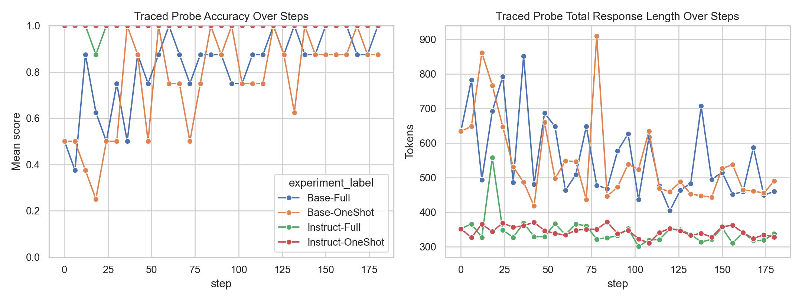
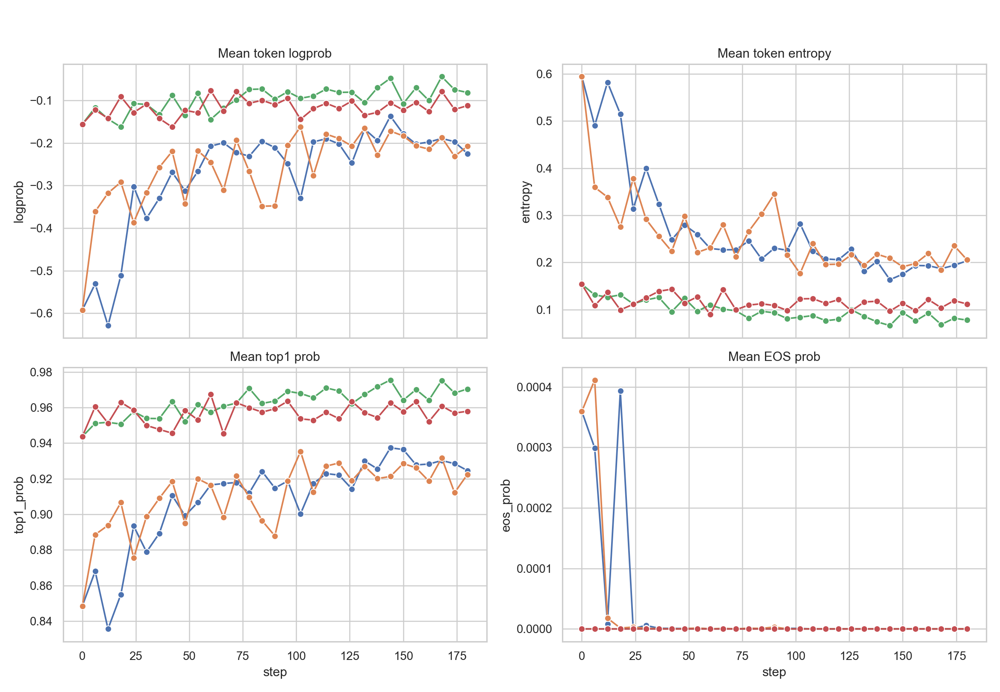
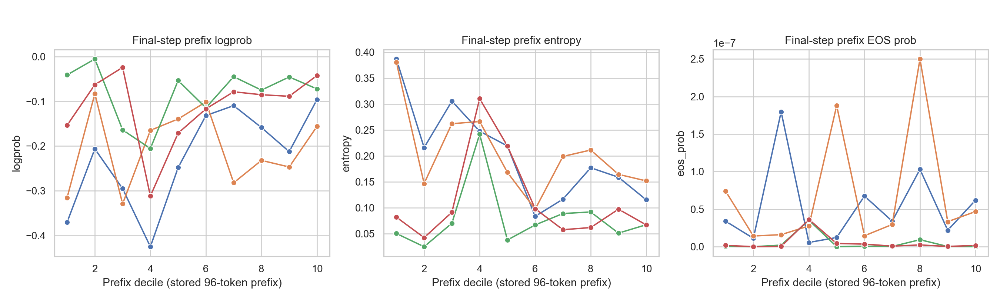
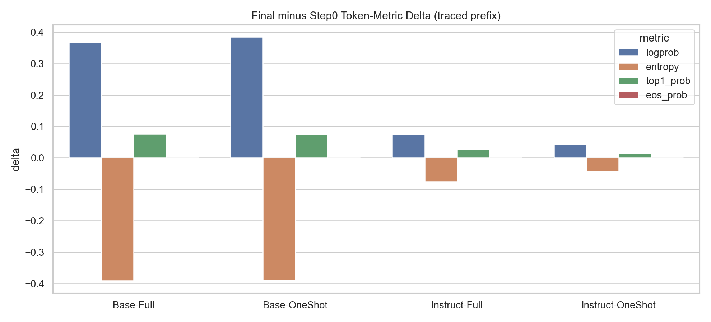
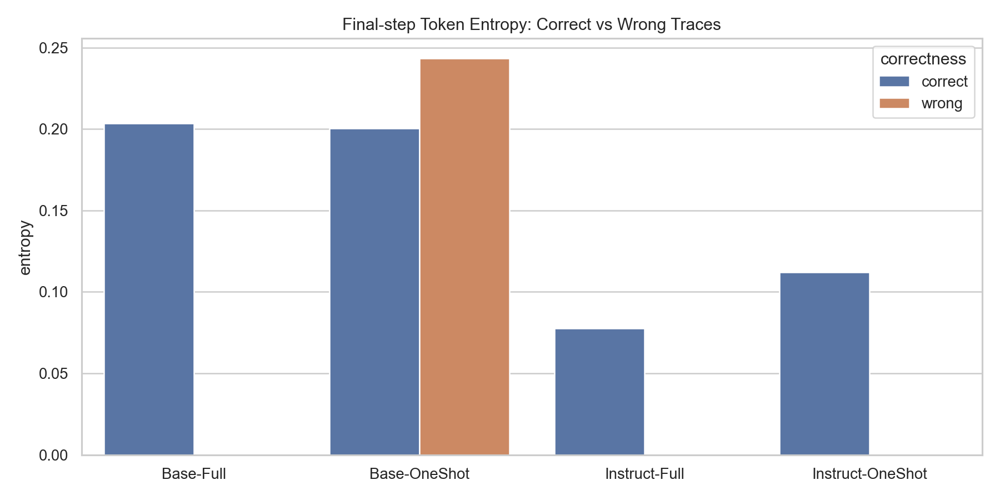

# Token Diagnostics 补充分析（四种训练方式）

## 1. 口径与限制
- `token_diagnostics` 只存在于 traced subset：每个 step 每个实验 8 条 traced rollout。
- traced subset 实际只覆盖 **1 道 probe 题**，四个实验追踪的是同一题的 8 次采样。
- 保存的是前缀 token 轨迹：每条只保留前 96 个 token 左右，且 `token_diagnostics_truncated=true`。
- 因此本报告回答的是：**在固定 probe 题上，训练如何改变早期 token 行为**，不应直接外推到全部 500 题。

Probe 题目：
- `Convert the point $(0,3)$ in rectangular coordinates to polar coordinates.  Enter your answer in the form $(r,\theta),$ where $r > 0$ and $0 \le \theta < 2 \pi.$ Let's think step by step and output the final answer within \boxed{}.`

## 2. 总体观察
- final step 上，traced probe score 最高的是 **Base-Full, Instruct-Full, Instruct-OneShot**，并列达到 1.000。
- instruct 系列从 step0 起就表现出更高 token confidence、更低 entropy、更短输出；训练后变化不大，说明它们一开始就在较稳定区域。
- base 系列训练带来的变化更大：prefix token 的 logprob 提升、entropy 下降、输出明显缩短，说明训练主要在修正早期生成的不稳定与冗长。
- `Base-OneShot` 在 final step 仍落后，说明 one-shot 方案对 base 模型的 token 级稳定化不如 full 训练充分。

## 3. Final-step 指标
| experiment_label | score | token_total_len | answer_tail_confidence | low_confidence_token_ratio | logprob | entropy | top1_prob | eos_prob | top5_mass | chosen_is_top1 |
| --- | --- | --- | --- | --- | --- | --- | --- | --- | --- | --- |
| Base-Full | 1.0 | 460.125 | 0.8855 | 0.0374 | -0.2251 | 0.2036 | 0.9246 | 0.0 | 0.997 | 0.9271 |
| Instruct-Full | 1.0 | 338.125 | 0.969 | 0.0177 | -0.0814 | 0.0778 | 0.9705 | 0.0 | 0.9998 | 0.9688 |
| Instruct-OneShot | 1.0 | 328.125 | 0.9725 | 0.0217 | -0.1122 | 0.1119 | 0.958 | 0.0 | 0.9996 | 0.9531 |
| Base-OneShot | 0.875 | 490.625 | 0.9075 | 0.0486 | -0.2075 | 0.2059 | 0.9224 | 0.0 | 0.9971 | 0.9167 |

## 4. Step0 -> Final 的 token 级变化
| experiment_label | logprob_delta_final_minus_step0 | entropy_delta_final_minus_step0 | top1_prob_delta_final_minus_step0 | eos_prob_delta_final_minus_step0 |
| --- | --- | --- | --- | --- |
| Base-Full | 0.3673 | -0.3908 | 0.0762 | -0.0004 |
| Base-OneShot | 0.3849 | -0.3885 | 0.074 | -0.0004 |
| Instruct-Full | 0.0744 | -0.076 | 0.0268 | -0.0 |
| Instruct-OneShot | 0.0435 | -0.0419 | 0.0143 | -0.0 |

## 5. Final-step 正误分组
| experiment | experiment_label | correctness | traced_tokens | logprob | prob | entropy | eos_prob | top1_prob | top5_mass |
| --- | --- | --- | --- | --- | --- | --- | --- | --- | --- |
| base_full | Base-Full | correct | 768 | -0.2251 | 0.8908 | 0.2036 | 0.0 | 0.9246 | 0.997 |
| base_oneshot | Base-OneShot | correct | 672 | -0.1905 | 0.8968 | 0.2005 | 0.0 | 0.9248 | 0.997 |
| base_oneshot | Base-OneShot | wrong | 96 | -0.3266 | 0.8576 | 0.2435 | 0.0 | 0.9056 | 0.9977 |
| instruct_full | Instruct-Full | correct | 768 | -0.0814 | 0.9559 | 0.0778 | 0.0 | 0.9705 | 0.9998 |
| instruct_oneshot | Instruct-OneShot | correct | 768 | -0.1122 | 0.9391 | 0.1119 | 0.0 | 0.958 | 0.9996 |

## 6. 图表
- 
- 
- 
- 
- 

## 7. 结论建议
- 如果你想用 token 级指标做训练诊断，当前 traced subset 更适合作为 **固定 probe**，用于监控训练是否让模型更短、更稳、更早收敛。
- 如果你想把 token 分析推广到任务层结论，建议下一轮把 `token_diagnostics` 覆盖到更多 probe 题，而不是只保留 1 道题。
- 对现有结果，最可信的结论是：**instruct 初始化已经把前缀 token 组织得更稳，base 训练主要是在补这个短板，而 one-shot 对 base 的修复不彻底。**